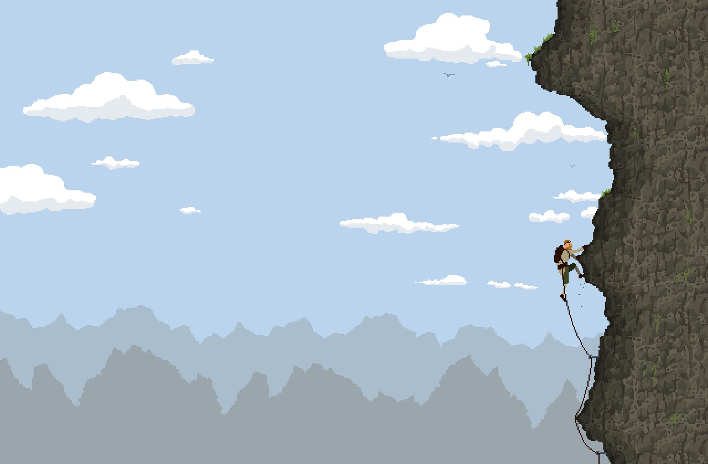

# Nordwand

<p align="center">
  
</p>

<p align="center"><em>A lone climber, a rope, and a wall that never quite looks the same twice.</em></p>

**Nordwand** is a physics-driven climbing prototype. You hang from a generated rock face and try not to let go. The mockup above is the look the game is aiming for: a quiet alpine north wall, pixel clouds, and a climber who is never more than one hold away from empty air.

The current build is the simulation underneath that picture — spring-particle physics, a ragdoll skeleton, a pixel rope, and a two-layer climbing system (decision + motor) that walks the wall hold by hold.

## Play

```bash
npm install
npm run dev
```

Then open [http://localhost:8000](http://localhost:8000). The canvas is 560×840, tall like the wall itself.

| Key | Action |
| --- | --- |
| **F** | Let go |
| **R** | New random wall |
| **P** | Pause |
| **H** | Help |
| **M** | Mute |
| **N** | Next song |
| **S** | Freeze physics (zero velocities) |
| **D** | Toggle debug |
| Mouse wheel | Zoom |

## How it feels

Every wall is generated from a noisy walk of segments, then studded with anchors. The face keeps growing above the climber, so the route never ends. The camera eases after the body. The climber is not a sprite with a jump button — they are a chain of particles:

- **Body** — pelvis, back, neck, head
- **Arms and legs** — elbows, wrists, knees, ankles
- **Grabs** — hands and feet pinned to wall anchors
- **Rope** — a Bresenham pixel line from the wall down to the pelvis

Distance springs keep limbs the right length. Angular constraints hold posture. Gravity pulls at 80 units. The climber and rope collide with the rock — they stay on the air side of the wall. If you let go, there is nothing left but the rope and the fall.

The **Climber** walks a fixed three-phase rotation: **LegReach** (the free foot flexes up to a higher anchor, latches), **Push** (the drive leg extends and the body rises while the latched arms adapt their angles), **HandReach** (the lowest hand reaches above the head and latches in extension). Targets come from a hard filter chain — reachability, feet-stay-below-hands, center-of-mass near the wall — never from scoring. Phases end on physical events (a latch, a reached extension), and a stall ladder (re-filter → relaxed reach → substitute move → hold) never forces a grab or releases a planted limb. The full behavior spec lives in `concept/climbing-plan.md`.

## Project

| | |
| --- | --- |
| Language | TypeScript **7.0.2** |
| Bundler | Vite 6 |
| Loop | `requestAnimationFrame` on a 2D canvas |
| Physics | Midpoint spring integration, 4 ms fixed step |

```
src/
  main.ts          entry, canvas setup
  Game.ts          input, pause, level load, frame loop
  Physics.ts       particles, springs, angular constraints
  Wall.ts          procedural face and anchors
  Skeleton.ts      body, limbs, grabs
  Rope.ts          pixel rope
  Climber.ts       decision layer: phases, filter chain, stall ladder
  ClimberMotor.ts  motor layer: move API, IK, angle animation
  Camera.ts        pixel-snapped world camera
  MusicPlayer.ts   songs and SFX
  PixelSprite.ts   nearest-neighbor scaled sprites
public/            CSS, control icons, sprites
concept/           visual target for the climb
```

```bash
npm run typecheck   # tsc --noEmit (TypeScript 7)
npm run build       # typecheck + Vite production build
```

## Concept

The image at the top is `concept/nordwand_mockup_04_large.png` — the intended mood of the finished game. Wide sky, layered mountains, a textured wall, and a climber who looks small because the drop is real. The live prototype is still drawing debug bones and wall segments; the mockup is the north face those bones are trying to become.

Music in the original build: *sevenhundredbeats* by Duncan Beattie.
